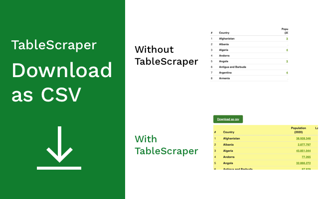

# TableScraper

Chrome extension that converts html tables in web pages to csv files.

You can download this extension from the chrome web store [here.](https://chrome.google.com/webstore/detail/tablescraper/emkcilhnngffafccblemkljfpkabpapg)

Here's some sample web pages you can try it out on:

- https://www.worldometers.info/geography/alphabetical-list-of-countries/
- https://www.worlddata.info/capital-cities.php
- https://www.britannica.com/topic/Kings-and-Queens-of-Britain-1856932
